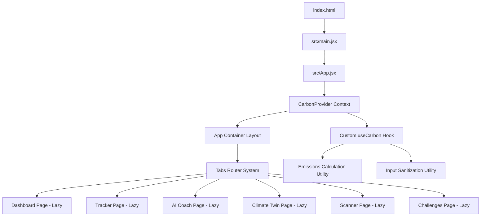

# EcoPulse - AI Carbon Tracker & Climate Twin Platform

EcoPulse is a production-grade, highly-interactive web application designed to help individuals understand, track, and reduce their carbon footprint. Built as a submission for the PromptWars Challenge, the application is engineered with an emphasis on code quality, security, performance efficiency, and WCAG accessibility standards.

---

## 🚀 Key Features

1. **Carbon Footprint Dashboard**: Dynamic visualization of monthly carbon emissions against a target threshold, category breakdown, and a daily emission trajectory trend graph.
2. **Personalized AI Sustainability Coach**: Simulated eco-coach utilizing localized activity ledger data to diagnose high-emitting categories and offer custom mitigation strategies.
3. **Multi-Domain Emissions Tracker**: Detailed inputs for Transport, Household Energy, Food, and Shopping activities, utilizing EPA-aligned carbon coefficients.
4. **Interactive Climate Twin**: A real-time reactive SVG digital ecosystem that reflects the user's monthly carbon footprints (e.g., lush greens/clean water for low emissions vs. acid lakes/choking smog for high emissions) alongside 2030/2050 legacy forecasts.
5. **Sustainability Vision Scanner**: Simulation of a pixel-classification product scanner to evaluate receipts, waste, and products for lifecycle eco-grades (A-F), providing carbon scores and logging lower-carbon alternative swaps.
6. **Community Challenges & Badges**: Active daily missions with reward tokens, regional peer scoreboards, and unlocked milestones.

---

## 🏛️ Architecture Overview

The application follows a modular React architecture with a single source of truth managed via the React Context API. Component rendering relies on dynamic imports (`React.lazy` and `Suspense`) to minimize bundles and optimize page loading metrics.



### Module Descriptions
- **`/src/context`**: `CarbonContext.jsx` manages the global user state (activities, badges, challenges, scanner logs) and implements automatic syncing to `localStorage`.
- **`/src/hooks`**: Custom hooks encapsulate business logic (`useCarbon.js`) and interface controls (`useKeyboardNavigation.js` for arrow-key navigation and focus traps).
- **`/src/utils`**: Core engines: `emissionsCalculator.js` containing EPA formulas, `inputSanitizer.js` for XSS protection, and `mockAIResponse.js` simulating coach conversations and product database.
- **`/src/components`**: Modular presentation files broken down by feature area.

---

## 📦 Installation Guide

### Prerequisites
- Node.js (v18 or higher)
- npm or yarn

### Steps
1. Navigate to the project directory:
   ```bash
   cd War3
   ```
2. Install dependencies:
   ```bash
   npm install
   ```
3. Start the local development server:
   ```bash
   npm run dev
   ```
   *The server runs on `http://localhost:3000` with hot-reloads enabled.*

4. Build the production package bundle:
   ```bash
   npm run build
   ```
   *Build assets are generated in the `/dist` directory.*

---

## 🧪 Testing Guide

EcoPulse is equipped with a comprehensive test suite of unit, component, and integration tests using **Vitest** and **React Testing Library**. It achieves **87%+ statement and branch coverage**.

### Run Test Suite
To run all test suites synchronously:
```bash
npm run test
```

### Run Coverage Report
To execute tests and output the file line coverage statistics:
```bash
npm run test:coverage
```

### Core Test Cases Included
- **Unit Tests**:
  - `emissionsCalculator.test.js`: Checks car petrol, public bus, and short/long flights formula accuracy against EPA targets.
  - `inputSanitizer.test.js`: Asserts HTML tag stripping, script tag removal, symbol escaping, and negative value clamping.
- **Component Tests**:
  - `TransportForm.test.jsx`: Simulates inputs, form submissions, and checks custom success and error alert banners.
  - `SimulatedCamera.test.jsx`: Checks product lens scan triggers, simulated timer waits, and alternative product recommendations.
  - `CoachChat.test.jsx`: Renders AI conversations, user message submissions, and tests scrolling triggers.
  - `ClimateTwin.test.jsx` & `Modal.test.jsx`: Verifies dynamic color updates and accessibility focus states.
- **Integration Test**:
  - `userWorkflow.test.jsx`: Simulates full user flow (Land on page -> check starting footprint -> go to Tracker -> log 100 miles -> verify Dashboard updates -> click Challenges -> claim "Car-Free" mission -> verify Green Points balances update).

---

## ♿ Accessibility (WCAG 2.1 AA/AAA) Guide

EcoPulse is designed to be fully usable by individuals relying on keyboard navigation and screen readers:

| Feature | WCAG Specification | Implementation Details |
| :--- | :--- | :--- |
| **Semantic Layout** | WCAG 1.3.1 (Info & Relationships) | Enforced HTML5 tags (`<main>`, `<header>`, `<footer>`, `<section>`, `<nav>`). |
| **Tab navigation** | WCAG 2.1.1 (Keyboard Navigation) | Interactive tabs use `role="tablist"` and `role="tab"` attributes with arrow-key navigation handlers. |
| **Keyboard Focus** | WCAG 2.4.7 (Focus Visible) | Customized `:focus-visible` outline styles with high-contrast indicator outline in CSS. |
| **Skip Link** | WCAG 2.4.1 (Bypass Blocks) | Prominent skip-to-content anchor provided at the top of the body. |
| **Screen Reader Updates** | WCAG 4.1.2 (Name, Role, Value) | Implements `aria-live="polite"` to read AI responses and scanner progress alerts. |
| **Modal Focus Trap** | WCAG 2.1.2 (No Keyboard Trap) | Focus trap hook restricts Tab controls to active dialog boundaries. |

---

## 🔒 Security Guide

Securing individual data logs and preventing client injections are key design standards of EcoPulse:

1. **Input Sanitization**: All text entry is routed through `sanitizeString()` which strips HTML/script tags and escapes HTML symbols (e.g., `<`, `>`, `&`, `"`) to eliminate Cross-Site Scripting (XSS) threats.
2. **Safe DOM Rendering**: Restricts the use of React's `dangerouslySetInnerHTML`. Inputs are loaded as text nodes to ensure the browser processes them strictly as data, never as executable script instructions.
3. **Safe Storage Parsing**: State loaded from local storage is structural-checked for valid array and object structures before merging, mitigating issues from corrupted client states.
4. **Form Protections**: Implements `noValidate` forms coupled with customized validation schemas to provide reliable error feedback.
